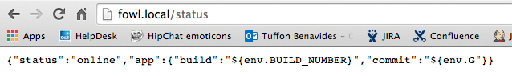
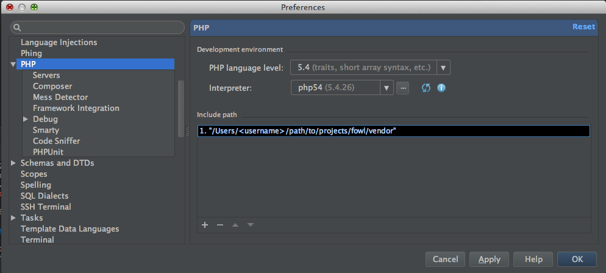
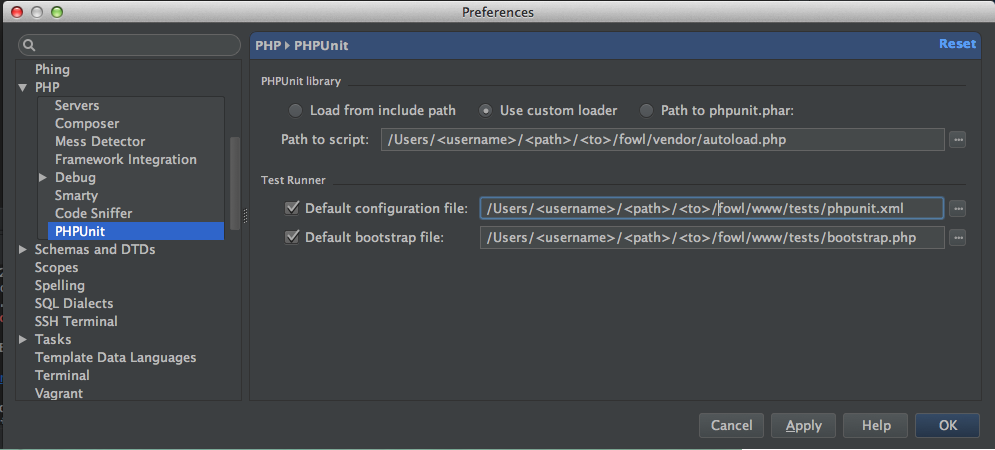
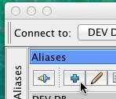

## OWL Local Environment Setup Guide (BOXEN)

* [Generate SSH keys](#genarate_SSH) 
* [Fork Repos and Join the DandB Org](#fork_repo)
* [Configure OWL Local Application Configuration File](#config_OWL)
* [Fork and Run Boxen](#fork_boxen)
* [Run Composer](#run_composer) 
* [Restart Apache and Test](#restart_apache)
* [Setup PHPStorm](#setup_PHPStorm)
* [Using Postman](#postman)
* [Database Access Setup (with SQuirreL SQL)](#database_access_setup)
* [Preparing to Use Bottle](#preparing_to_use_bottle)

[You might also be interested in... ](#also_interested_in)

------------------------------------------------------------------------
#### 

#### 1. Generate SSH Keys
* Add SSH Key to GitHub. Go to https://help.github.com/articles/generating-ssh-keys/  
* Submit your public key to the help desk to be added to Active Directory.   
* Make a HelpDesk ticket at: https://dandbhelpdesk.zendesk.com/
#### 

#### 2. Fork Repos and Join DandB Org
* Generate OAuth token from GitHub:  
  * https://help.github.com/articles/creating-an-access-token-for-command-line-use/  
* Set Up Jenkins jobs: To be done by IMG
  * Visit https://ci.malibucoding.com/job/add_new_dev/  
  * Enter GitHub username, Teams, and Role  
  * For fOWL the teams will be 'PULL-ONLY, FOWL'  
  * Click Build  
* Visit https://ci.malibucoding.com/job/Accept_Org_Fork_New_Dev_Repos
  * Enter your GitHub username, OAuth Token (New Devs), and list of Repos you would like to fork.
  * For fOWL the repos you will need will be 'fowl, phoenix, salt-config, jenkins-jobs'
  * Click Build  

For information on how to setup and sync forked repos see :  
 * https://help.github.com/articles/configuring-a-remote-for-a-fork  
 * https://help.github.com/articles/syncing-a-fork  

####   
#### 3. Configure OWL Local Application Configuration File  
Update /etc/apache2/extra/dev_db.include with \<username\> and \<password\> and ensure the entries match existing file.  
[OWL Setup Guide - dev_db.include](https://github.com/tanvioka/try/blob/Step3/dev_db/dev_db_include.md)  

#### 
 
#### 4. Fork and Run Boxen  

Forking this repo will be handled above when accepted into DandB GitHub  
Fork the following repo: https://github.com/taoistmath/USSBoxen  
Open Terminal and run the following commands:  
\<team\> can be any of the following: fowl, phoenix, helios, automation  
(fowl includes phoenix, helios includes verified and mycredit, and automation includes helios and fowl)

> sudo mkdir -p /opt/boxen &nbsp;&nbsp;&nbsp;&nbsp;&nbsp;&nbsp;&nbsp;&nbsp;&nbsp;&nbsp;&nbsp;&nbsp;&nbsp;//Do **not** copy this line! **You have to type it!**  
sudo chown ${USER}:staff  &nbsp;&nbsp;&nbsp;&nbsp;&nbsp;&nbsp;&nbsp;&nbsp;&nbsp;&nbsp;&nbsp;&nbsp;      /opt/boxen  
git clone git@github.com:<github_username>/USSBoxen.git /opt/boxen/repo  
cd /opt/boxen/repo  
git remote add upstream git@github.com:taoistmath/USSBoxen.git  
./script/boxen --no-fde  &nbsp;&nbsp;&nbsp;&nbsp;&nbsp;&nbsp;&nbsp;&nbsp;&nbsp;&nbsp;&nbsp;&nbsp;&nbsp;&nbsp;&nbsp;&nbsp;&nbsp;//This step will ask for sudo pw, github login, and github pw  
source /opt/boxen/env.sh &nbsp;&nbsp;&nbsp;&nbsp;&nbsp;&nbsp;&nbsp;&nbsp;&nbsp;&nbsp;&nbsp;&nbsp;//This step will load Boxen's environment  
boxen --srcdir ~  &nbsp;&nbsp;&nbsp;&nbsp;&nbsp;&nbsp;&nbsp;&nbsp;&nbsp;&nbsp;&nbsp;&nbsp;&nbsp;&nbsp;&nbsp;&nbsp;&nbsp;&nbsp;&nbsp;&nbsp;&nbsp;&nbsp;&nbsp;&nbsp;&nbsp;&nbsp;&nbsp;//This step set your source directory to your home directory  
source /opt/boxen/env.sh &nbsp;&nbsp;&nbsp;&nbsp;&nbsp;&nbsp;&nbsp;&nbsp;&nbsp;&nbsp;&nbsp;&nbsp;//This step will reload Boxen's environment  
./script/boxen --no-fde \<team\> &nbsp;&nbsp;&nbsp;&nbsp;//This step will set up apache files and clone your repos

#### 

#### 5. Run Composer

###### Directions for Running Composer
 * Navigate to the root of the fOWL repo.  
 * If this is the first time you've pulled fOWL, run 'composer install'.  
 * From time to time, you'll need to run composer update as libraries get updated.  

*Note: it may show warnings when running the install. This is most likely due to updates being available for the libraries, but have not been pulled yet.*

###### What is Composer? 
Composer is a PHP package manager. It allows your app to only contain the code that you're building within version control, and let outside libraries be added in when necessary. In addition, it provides autoloading of those libraries, making the process of adding things painless, simple, and easy.    

A good reference for packages we can add and install are listed below: 
 * https://packagist.org/

#### 

#### 6. Restart Apache and Test

> `sudo apachectl restart`

visiting fowl.local/status should yield

#### 

#### 7. Setup PHPStorm

##### OWL Setup Guide - PHPStorm

* Running PHPUnit through PHPStorm requires PHPStorm 8
* In PHPStorm preferences assign PHP54 as your interpreter and provide the path to vendor in your include path:

* and setup PHPUnit config files. NOTE: You must change PHPUnit library to use the custom loader specified below:

#### 

#### 8. Using Postman
* Postman is a Chrome extension that helps you be more efficient while working with APIs  
* Postman has been bookmarked in Chrome and is also available at chrome-extension://fdmmgilgnpjigdojojpjoooidkmcomcm/index.html  
* Now you can have a small, manageable, set of collections that work in each environment!
Note: the access tokens are attached and will expire, you can easily update them in Postman.

#### 

#### 9. Database Access Setup (with SQuirreL SQL)  

 * For most purposes, the database can be accessed in SQuirreL SQL without the need for a more complicated virtual machine setup.  
 * Launch SQuirreL SQL.  
 * In the Aliases pane, edit the 4 aliases and add your Active Directory credentials:  
 

For Example:

| Field         | Value                                                             | 
| ------------- |:-----------------------------------------------------------------:| 
| Name          | DEV dbcc_ecomm                                                    | 
| Driver        | jTDS SQL Server                                                   |  
| URL           | jdbc:jtds:sqlserver://10.26.34.100:63695;DOMAIN=CREDIBILITY;      |  
| Username      |  your AD credentials                                              |  
| Password      | your AD credentials                                               |  

#### 

#### 10. Preparing to Use Bottle  
For more information regarding Ship In A Bottle (SIAB) please see the following documentation:  
[Ship in a Bottle - Deployment Guide](dev_db/ship_in_a_bottle.md)

> cd ~/projects/salt-config   
vagrant status      
vagrant up saltmaster
 
#### 

#### 9. You might also be interested in...  
* [OWL Logging on Mac OSX](dev_db/OWL_Logging_on_MAC.md)  
* [PHPStorm](http://www.jetbrains.com/phpstorm/)  / [PHP Storm Keys](dev_db/PHP_Storm.md)  
* [tunnelblick (for vpn)]  (https://code.google.com/p/tunnelblick/)
* [Alias Shortcuts - Improve Efficiency](dev_db/alias_shortcuts.md)  
* [iTerm2](http://iterm2.com/)
* [Zshell](http://ohmyz.sh/)

