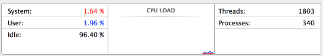
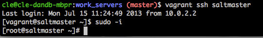
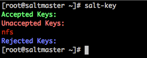
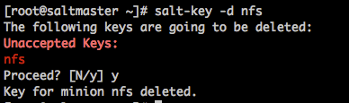

### Ship in a Bottle - Deployment Guide

#### Summary  
This guide serves to assist in explaining what is Ship In A Bottle (SIAB), how to deploy it, how to deploy your applications to SIAB, and some common troubleshooting techniques that are inherently related to dealing with SysAdmin responsibilities.

##### What is Ship In A Bottle?  

* At a high level, SIAB combines several existing technologies to help programmatically deploy an environment onto your physical machine where you can then deploy your applications. 
* In short, SIAB gets you, as close as reasonably possible, the environment that makes up Production. 
* Today, this includes: front end (nginx), load balancer (HAproxy), nfs, queue (hornetQ), PHP Application server, Java Application server, and Java Utility server. 
* You will still be connecting to the QA database on AWS.
* More in-depth, SIAB leverages Salt-stack, VirtualBox, Vagrant, and various shell scripts to wire everything up.

##### What is Salt-stack?  

Salt, in a nutshell, relies on remote execution. Deployment of salt includes a "master", and one or more "minions". The minions and master establish a relationship that allows the master to execute commands remotely on the minion.  

On top of this remote execution foundation, Salt allows the SysAdmin team to maintain configuration of various server types, e.g., load balancer, Java and PHP application servers. These configurations are version controlled. Like other programming languages, writing Salt configs requires specialized knowledge. The configurations allow for SysAdmin to configure a new server programmatically, reducing errors related to the manual configuration process.  

> * The following command will send the command "state.highstate" to the server named "php".  
* This basically tells the "php" server to pull configurations from master, and configure itself.
root@saltmaster$ salt php state.highstate

##### What is VirtualBox? 

Modern computer systems are so powerful that most of the time, it is underutilized. Try launching "Activity Monitor", click on the CPU tab, and take note the "Idle" value.

Virtualization was developed to better take advantage of these idle resources. VirtualBox is an application that allows you to create, or "provision", virtual computers within your physical computers. VirtualBox creates "containers" for your virtual computers to live. By running multiple virtual machines on your physical, or host, machine, you are better utilizing those idle resources.  
In addition to a GUI application, VirtualBox also comes with a set of command-line utilities that allow for the ability to programmatically provision virtual machines. This is where Vagrant comes into play.

##### What is Vagrant?  

Essentially, Vagrant is a command-line Ruby application that parses a set of configurations, leverages those VirtualBox command-line utilities, to provision virtual machines for you! There's no need to go to the GUI to do this. The configurations have already been created for you.

##### All Together Now!  

The combination of Vagrant and Salt-stack configurations allow for the systematic and programmatic provisioning of a Production like environment on your physical machine. All together now, this is Bottle!

##### Expectations & Assumptions  
Joining DandB, one of the fundamental expectations of you is to become a full stack developer. What does this mean? It means that you are not only expected to understand the programming languages required to develop web applications, you will also eventually need to understand various database optimization techniques, as well as support the underlying infrastructure that your applications rely on. You'll have to learn some DBA/DBE knowledge. For Bottle, you'll have to learn some Linux SysAdmin knowledge too.

##### Prerequisites  

* Github account and access to dandb/salt-config  
* Understand how to clone repositories  
* TunnelBlick installed for VPN access  
* Valid VPN account to connect to the database  
* Install  
  * ~~brew (http://brew.sh/)~~  
  * VirtualBox (4.2.18) - (OSX - http://download.virtualbox.org/virtualbox/4.2.18/VirtualBox-4.2.18-88780-OSX.dmg)  
    * Also here: //Technology File Share/software/VirtualBox/OS X  
  * VirtualBox Extensions (4.2.18)-http://download.virtualbox.org/virtualbox/4.2.18/Oracle_VM_VirtualBox_Extension_Pack-4.2.18-88780.vbox-extpack  
    * Also here: //Technology File Share/software/VirtualBox/OS X  
  * Vagrant (1.2.7) - (OSX - http://files.vagrantup.com/packages/7ec0ee1d00a916f80b109a298bab08e391945243/Vagrant-1.2.7.dmg)  
    * Also here: //Technology File Share/software/vagrant
 

#### Deployment Steps  

#####Configuring Your Hosts Environment  
Modify your /etc/hosts file and add the following entries.

 > 184.72.43.112 &nbsp;&nbsp;&nbsp;&nbsp;&nbsp;&nbsp;&nbsp;&nbsp;&nbsp;&nbsp;&nbsp;  config  
192.168.56.110 &nbsp;&nbsp;&nbsp;&nbsp;&nbsp;&nbsp;&nbsp;&nbsp;&nbsp; bottle.malibucoding.com  
192.168.56.111 &nbsp;&nbsp;&nbsp;&nbsp;&nbsp;&nbsp;&nbsp;&nbsp;&nbsp; mycr-bottle.malibucoding.com  
192.168.56.112 &nbsp;&nbsp;&nbsp;&nbsp;&nbsp;&nbsp;&nbsp;&nbsp;&nbsp; api-bottle.malibucoding.com  
192.168.56.120 &nbsp;&nbsp;&nbsp;&nbsp;&nbsp;&nbsp;&nbsp;&nbsp;&nbsp; cms-bottle.malibucoding.com  
192.168.56.185 &nbsp;&nbsp;&nbsp;&nbsp;&nbsp;&nbsp;&nbsp;&nbsp;&nbsp; tar-bottle.malibucoding.com  
192.168.56.175 &nbsp;&nbsp;&nbsp;&nbsp;&nbsp;&nbsp;&nbsp;&nbsp;&nbsp; jehp-bottle.malibucoding.com

##### Fork it  

Fork your own copy of saltconfig  
* Go here https://github.com/dandb/salt-config  
* Click "Fork" on the top right of the page   
* Fork it to yourself

##### Pull The Code  

Now clone the forked repo by either copying/pasting the git clone URL into terminal or   
Use the command below and edit it so that you are using your own forked repo.

> `dev@local$ git clone git@github.com:<your-repo>/salt-config.git`

##### Pre-Do-Work-Son!

> You will ALWAYS need to be at the directory with Vagrantfile   
> dev@local$ cd /<path to>/salt-config/
 
> This will give you a list of commands to reference   
> dev@local$ vagrant help

Once inside this directory, there are several commands that you can use to bring various parts of your local Bottle environment up or down.

##### Vagrant Commands  

**Vagrant status**  
This lists all of the available pre-configured machines within the Bottle environment. The column on the left are the names of virtual machines which you will reference with various vagrant commands. The column on the right indicates the virtual machine's current state.

> dev@local$ vagrant status  
Current machine states:    
saltmaster &nbsp;&nbsp;&nbsp;&nbsp;&nbsp;&nbsp;&nbsp;&nbsp;&nbsp;&nbsp; not created (virtualbox)  
front &nbsp;&nbsp;&nbsp;&nbsp;&nbsp;&nbsp;&nbsp;&nbsp;&nbsp;&nbsp;&nbsp;&nbsp;&nbsp;&nbsp;&nbsp;&nbsp;&nbsp;&nbsp;&nbsp; not created (virtualbox)  
lb   &nbsp;&nbsp;&nbsp;&nbsp;&nbsp;&nbsp;&nbsp;&nbsp;&nbsp;&nbsp;&nbsp;&nbsp;&nbsp;&nbsp;&nbsp;&nbsp;&nbsp;&nbsp;&nbsp;&nbsp;&nbsp;&nbsp;&nbsp;&nbsp; not created (virtualbox)  
nfs  &nbsp;&nbsp;&nbsp;&nbsp;&nbsp;&nbsp;&nbsp;&nbsp;&nbsp;&nbsp;&nbsp;&nbsp;&nbsp;&nbsp;&nbsp;&nbsp;&nbsp;&nbsp;&nbsp;&nbsp;&nbsp;&nbsp; not created (virtualbox)  
php  &nbsp;&nbsp;&nbsp;&nbsp;&nbsp;&nbsp;&nbsp;&nbsp;&nbsp;&nbsp;&nbsp;&nbsp;&nbsp;&nbsp;&nbsp;&nbsp;&nbsp;&nbsp;&nbsp;&nbsp; not created (virtualbox)  
phoenix    &nbsp;&nbsp;&nbsp;&nbsp;&nbsp;&nbsp;&nbsp;&nbsp;&nbsp;&nbsp;&nbsp;&nbsp;&nbsp; not created (virtualbox)  
phoenixutils &nbsp;&nbsp;&nbsp;&nbsp;&nbsp;&nbsp; not created (virtualbox)  
queue &nbsp;&nbsp;&nbsp;&nbsp;&nbsp;&nbsp;&nbsp;&nbsp;&nbsp;&nbsp;&nbsp;&nbsp;&nbsp;&nbsp;&nbsp; not created (virtualbox)  
mmonit  &nbsp;&nbsp;&nbsp;&nbsp;&nbsp;&nbsp;&nbsp;&nbsp;&nbsp;&nbsp;&nbsp;&nbsp;&nbsp; not created (virtualbox)  
solr &nbsp;&nbsp;&nbsp;&nbsp;&nbsp;&nbsp;&nbsp;&nbsp;&nbsp;&nbsp;&nbsp;&nbsp;&nbsp;&nbsp;&nbsp;&nbsp;&nbsp;not created (virtualbox)  
logs &nbsp;&nbsp;&nbsp;&nbsp;&nbsp;&nbsp;&nbsp;&nbsp;&nbsp;&nbsp;&nbsp;&nbsp;&nbsp;&nbsp;     not created (virtualbox)  
openvpn &nbsp;&nbsp;&nbsp;&nbsp;&nbsp;&nbsp;&nbsp;    not created (virtualbox)  
This environment represents multiple VMs. The VMs are all listed  
above with their current state. For more information about a specific VM, run `vagrant status NAME`. 

**vagrant up**  
> This will either create a new, or fire up an existing virtual machine. In this example, we're creating the front end server.
> dev@local$ vagrant up front  

> TIP: You can reference serveral machines with the 'vagrant up' command. Note they are SPACE separated.
> dev@local$ vagrant up front lb nfs queue php phoenix phoenixutils  

> TIP/WARNING: Running the following command alone will fire up ALL of your virtual machines. This is not advised unless you know what you're doing.
> dev@local$ vagrant up

**vagrant ssh \<virtual machine name\>**  

This SSH you into the virtual machine. Vagrant has configured a special network adapter that makes it possible for vagrant to talk to your virtual machine to allow this to happen. Note, if you ever SSH into the "external" IP address with the user vagrant, the password is also vagrant.  

**vagrant suspend**  

Rather than shutting your virtual machines down with "vagrant halt", you can suspend them, and put them in the "saved" state. This is basically standby. TIP: You should suspend them in reverse order.  

**vagrant destroy**  

This will shutdown and destroy your virtual machine. Completely.

##### Salt-Minion Commands From Inside Minion Virtual Machines  
These commands are ONLY called from salt-minions. You DON'T need to call this command from "saltmaster".  

**salt-call -l debug state.highstate**
>  * In this example, we have already "vagrant ssh nfs". From the terminal on "nfs", we have also "sudo -i".  
 * Note: You will need to do this for all minions you SSH into: "sudo -i".  
 * The following command basically tells the salt-minion on "nfs" to pull configurations down from "saltmaster".  
 * You will see a LONG series of logging statements that "walk" you through the process as salt-minion is configuring this server.  
 * You will also see errors (in red) that are not pertinent. This list is not inclusive, but ignore errors relating to: New Relic, Munin and monit.  
 * The "-l debug" flag basically tells salt-minion to be more verbose.  
 * "state.highstate" is a Salt specific command.  
 root@nfs$ salt-call -l debug state.highstate
 
 
##### Salt-Master Commands From Inside Saltmaster Virtual Machine 

These commands are ONLY called from within "saltmaster".
> From your local laptop  
dev@local$ vagrant ssh saltmaster  
vagrant@saltmaster$ sudo -i  
root@saltmaster$

**salt-key**  

The communication between master and minions need a secure way to communicate. Part of this process is establishing a key on master. The commands help you list and troubleshoot. A valid key allows you to also execute remote calls on minions.

> This will list ALL of the keys  
root@saltmaster$ salt-key

Sometimes you need to delete the keys when you aren't able to "communicate" with a particular minion from the server via Salt
> This deletes a key. Sometimes you will need to do this if communication between master and minion doesn't seem to be working.
> root@saltmaster$ salt-key -d <virtual machine name>  

>After deleting the key from the server, you will need to restart the minion on the client. Two ways to do this.
> root@nfs$ service salt-minion restart  

>OR just restart the server altogether
> root@nfs$ shutdown -r now  

>When the server comes backup, try the following command.  
>In this example, you're basically send the command 'hostname' to the virtual machine 'nfs' from 'saltmaster'.  

root@saltmaster$ salt -L nfs cmd.run 'hostname'

##### Do-Work-Son!  
The following sections are in a specific order. You should follow them in this order.  
* ...in knowing the order and understanding how everything works, you can omit front and lb. stick to nfs and php, and make sure your local hosts file is correctly pointing to the PHP app server, NOT the front, which shouldn't exist.  
* up stuff in a given order  
* highstate stuff  
* turn off firewall
 
##### Helpful tips

* ORDER of state.highstate.  
* salt key  
* salt -L nfs,php cmd.run 'hostname'  
* service iptables off  
* vagrant up. sudo -i.
  * turn off filewall
  * test script
  * tip on why suspend them in reverse order. there are dependencies of up...on NFS and queue.....  

##### Shortened Installation Guide  
 * See README file at https://github.com/dandb/salt-config/tree/release-next/work_servers

